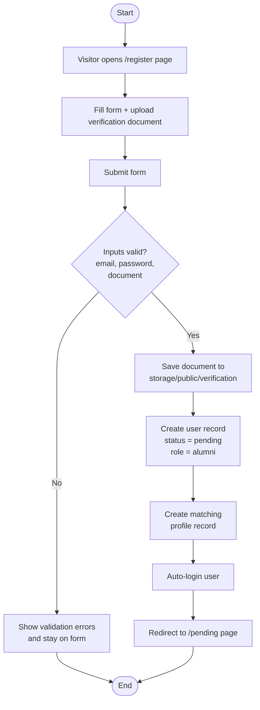
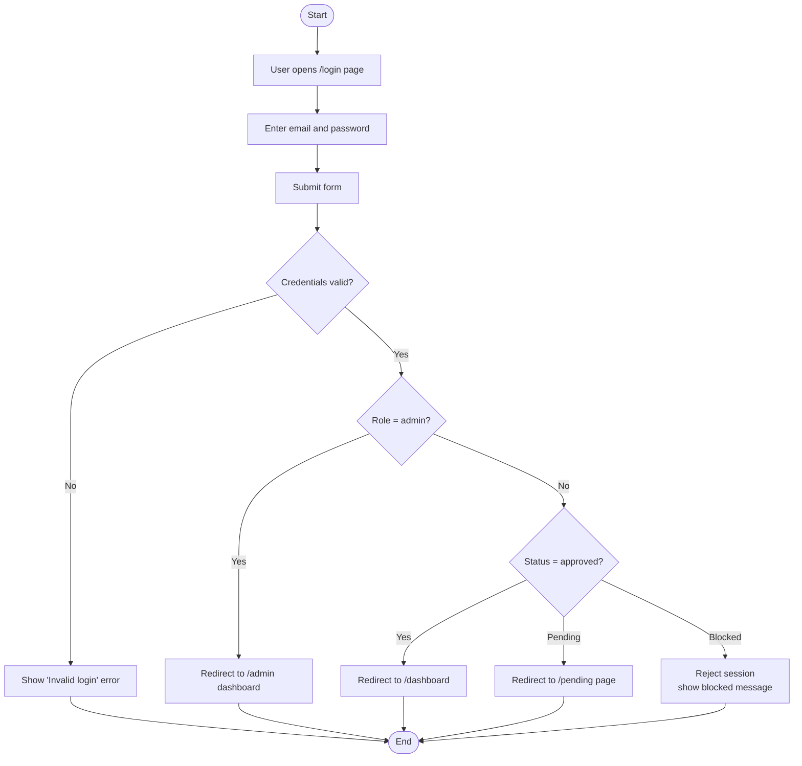
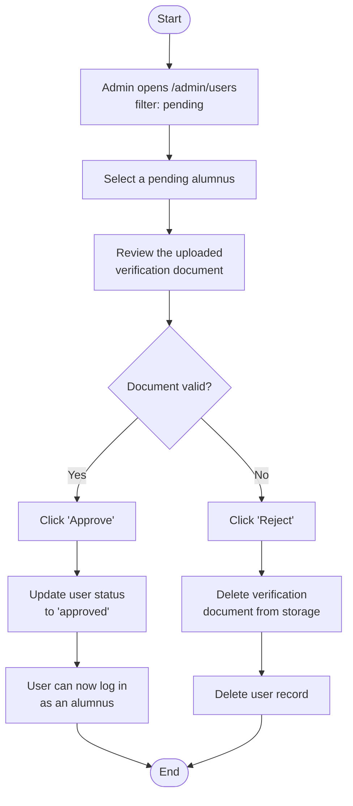
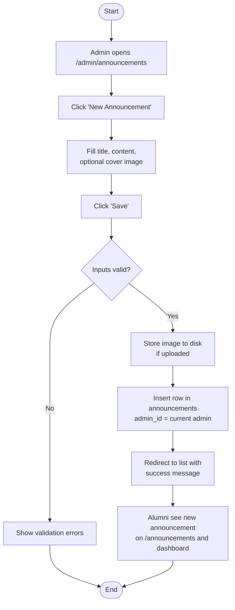
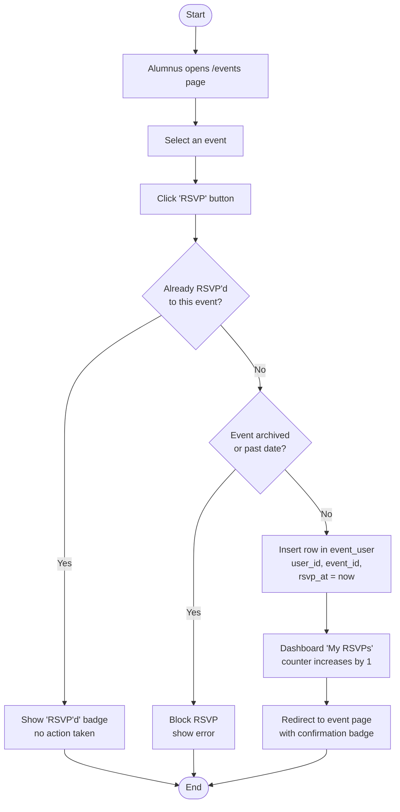

# Process Flowcharts — Mermaid Source

How to use:
1. Open https://mermaid.live
2. Delete the sample code on the left panel
3. Copy ONE flowchart block below (between the ```mermaid fences) and paste it
4. The diagram renders on the right
5. Click "Actions" -> "PNG" (or SVG) to download
6. Repeat for each flowchart


-------------------------------------------------------------------------------
5.1  USER REGISTRATION
-------------------------------------------------------------------------------




-------------------------------------------------------------------------------
5.2  USER LOGIN
-------------------------------------------------------------------------------




-------------------------------------------------------------------------------
5.3  ADMIN APPROVAL (USER VERIFICATION)
-------------------------------------------------------------------------------




-------------------------------------------------------------------------------
5.4  ADDING DATA (CRUD) - ADMIN CREATES AN ANNOUNCEMENT
-------------------------------------------------------------------------------




-------------------------------------------------------------------------------
5.5  TRANSACTION - ALUMNI RSVP TO AN EVENT
-------------------------------------------------------------------------------


